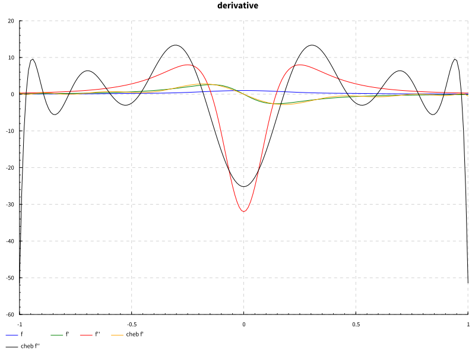
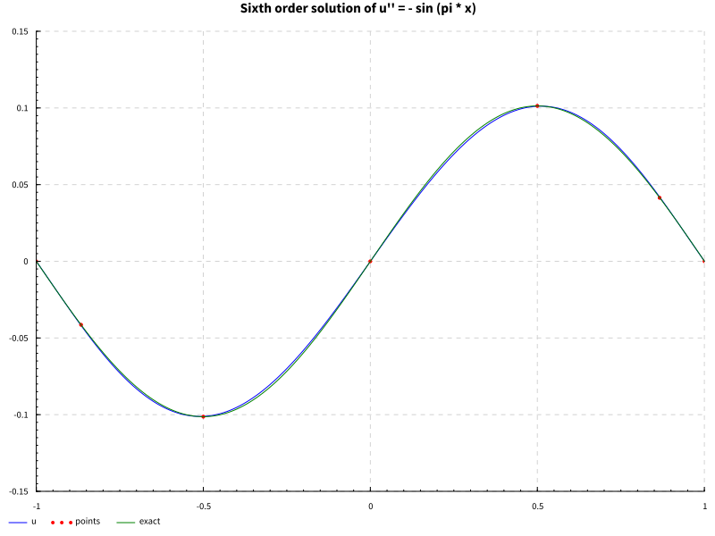

In a previous post I outlined the Fast Fourier Transform, which has many obvious uses regarding waves and periodic functions.
Personally, I have found more use in non-periodic function approximation, which we do largely with polynomials of various orthogonal bases.
In an incredible twist of fate, it turns out that the most ubiquitous polynomial basis, Chebyshev, is "Fourier in disguise" i.e. we can get one from the other under a special change of variables.
This means in some sense that in his study of the heat equation, Fourier solved not only all questions of periodic approximation, but that one hundred years later it would be realized that he had solved all non-periodic ones as well.
We can then put our DFT to good use solving any problem involving polynomial interpolation on an interval.

# Overview of Chebyshev
I won't belabor the details of approximation theory here. 
For references, I usually turn to Boyd's *Spectral Methods* book (a strange and wonderful gem), or Trefethen's *Approximation Theory and Approximation Practice*, but often the most useful is searching for relevant source code, as the theory is mainly relevant to justification and glosses over implementation.
The one aspect I will discuss is roughly how we translate from the periodic world of Fourier to the polynomial world of Chebyshev.

The first step of interpolation is choosing what points we wish to interpolate at.
For a periodic domain, we can show in various contexts that uniformly spaced points are optimal for various purposes.
Perhaps surprisingly, this is not true for an interval.
We will take the (non-periodic) interval \\( (-1, 1) \\) as the domain throughout.
There are various methods for choosing a set of points, depending on what constraints you make of the basis functions, and in what sense you wish to optimize.
Here we begin to overlap with the classical study of quadratures, as approximating a function and approximating its integral go hand-in-hand, these are often referred to as quadrature points.
One such set of points are the Chebyshev nodes (there are actually two kinds of Chebyshev polynomials, and hence two sets of points, but we can ignore this here), which are the extremal points of the Chebyshev polynomials.
Looking at the picture of them, we see they correspond exactly to uniformly spaced points on the unit circle, projected onto the real line, giving us our first glimpse into how related this is to Fourier polynomials.

From a practical, numerical perspective, we see that this pushes the points out towards the endpoints non-linearly, directly counteracting Runge's phenomenon and other issues we encounter when interpolating at uniformly spaced points.

# FFT
Chebyshev polynomials are a critical tool in approximation theory, even for studying existence and convergence of exact (theoretical) solutions.
One might think you could just use Taylor series for everything if you don't care about numerical convergence speed, but this is not the case, and different approximations have vastly different convergence radii and geometry, and can help us understand qualitative aspects of convergence, which can have practical implications.
For the engineer, there is another reason Chebyshev approximation is so valuable, the ability to compute it with the Fast Fourier Transform.
The FFT having linearithmic/log-linear complexity is one of the miracles of signal processing, and we can then leverage seasoned numerical libraries and specialized hardware to get much of Chebyshev for free.
I will not go into how we show this, but the main thrust of it is that Chebyshev can be viewed as Fourier under a somewhat strange looking change of variables \\( T_n(\cos \theta) = \cos(n \theta) \\).
Practically, we can compute the Chebyshev transform by sampling a function at the Chebyshev nodes, mentally thinking of how this projects back onto the top half of the unit circle, and we then reflect these points onto the bottom half of the unit circle, giving us twice as many points, which cover \\( [0, 2\pi]\\) in this projection.
We can then apply the FFT (really we only need the Discrete Cosine Transform, half of the FFT) to get the coefficients of our polynomial basis, just like Fourier.
This reflection trick is strangely not often mentioned in the theory, but is critical if you want your implementation to work.
It works because of the symmetry of the cosine transform.

# Approximating a Function
In approximating a function, the question is to what accuracy? 
With Chebyshev, we can expect rapid convergence for anything remotely continuous, let alone differentiable.
For discontinuous functions, if the discontinuities are known, it is always preferable to approximate in sections, regardless of method, but Chebyshev can often perform in all but the most pathological scenarios, up to geometric (exponential) convergence for analytic functions.
Depending on application, we may be constrained as to the method of sampling, but in general we usually assume computationally cheap sampling across the entire domain, such as in an interactive environment like Mathematica.
With the efficiency of FFT, if there are no hard time constraints (i.e. real-time), we can even adaptively sample until sufficient convergence. 

For the implementer, the main question becomes, in what representation do I store the approximation?
We can go back and forth between storing the samples, and storing the basis coefficients, and both have their advantages.
Using barycentric interpolation on the sample points, we can do quite a lot without using the coefficients at all, with no loss in accuracy.
Using coefficient representation, we can quickly, and with good numerical stability, compute the approximation at a point using the Clenshaw algorithm, a recursive method of polynomial evaluation. 
In the sample representation we can perform arithmetic operations, such as adding two functions, trivially (though it may require re-sampling if they have different numbers of samples).
In the coefficient representation, we can differentiate the function by applying differentiation as a linear operator, allowing us to solve differential equations.


# Differentiating a Function & Solving an ODE

It is well known that differentiation is a linear operator, the off-diagonal matrix for differentiating a polynomial in the standard basis is often shown in undergraduate linear algebra courses. 
What is less well known is that when similar ideas are applied to a more numerically useful basis, we can solve huge classes of common ODEs with excellent convergence rates.
This gave rise to an entire field, typically called "Spectral Methods", which solve a differential equation *globally* using some method of collocation, as opposed to Finite Element type methods, which solve *locally* using local basis functions, though these methods are often used in combination.
For Chebyshev methods, we can construct a differential operator directly as a matrix, and even square the matrix to get a second derivative, though there are some tricky questions of conditioning and boundary conditions.
Here is a plot showing a function, its derivatives, and the Chebyshev approximations.

If one is familiar with ODEs, it is not hard to see how we could use this to solve differential equations, given that we figure out how to represent boundary conditions and initial values.
Here is an example of how accurately we can solve an ODE defining a trigonometric function with only seven sample points (sixth-order Chebyshev approximation).
With any more points we would no longer be able to visually distinguish them on the plot. 


# Closing Remarks
A common refrain of numerical libraries is that, if you can understand the theory, you can often implement quite advanced algorithms in just a few dozen lines of code, even without the typical scientific computing primitives.
The great difficulty of the library creator and maintainer is the thousands and thousands of lines of code that actually make it useful, which often requires a great amount of thought and many iterations to get the core design correct.
As someone writing our own implementations of algorithms, this means we get a quick thrill of rapidly seeing a proof of concept to fruition, but the bitterness of knowing how far we are from something genuinely useful, unless we wish to spend thankless months building and maintaining "the boring parts."

For Chebyshev libraries, I recommend using ApproxFun.jl in Julia or Chebfun in Matlab, depending on your preference.

I have implemented enough in Haskell to solve some simple ODEs, and decided to stop before going down the rabbit hole of features. 
The main choices to make in going further are, which representation do you use (sample points or coefficients), and if the target usage warrants highly dynamic behavior for interactive applications, or a more strictly defined numerical building block for something such as real time use.
In particular with Haskell one could use the type system to ensure semantic correctness of your library primitives, something I neglected.
For posterity, my implementation is below.

# Haskell

```haskell
module Chebyshev where

import Numeric.GSL.Fourier (fft, ifft)
import Numeric.LinearAlgebra.Data
import Numeric.LinearAlgebra ((#>), (<\>))
import Numeric.Natural
import qualified Data.Vector.Generic as V

{- Cheb - representation of our Chebyshev approximation.
 We store this using a sample at the extremal nodes, and not coefficients, following Chebfun.
 This has numerous benefits, and we can go between representations as needed -}
newtype Cheb = Cheb {getNodes :: Vector R}
type ChebNodes = Vector R
type ChebCoefs = Vector R
-- | Function to sample from in computing a Cheb
newtype Function = Function {evalF :: R -> R}

-- | Compute the Nth extremal nodes, i.e. the interpolation points for our Cheb
extremalChebNodes :: Natural -> ChebNodes
extremalChebNodes n = build (fromIntegral n + 1) (\x -> cos (pi * x / fromIntegral n))

-- TODO: make size dynamic based on convergence
{- | Compute a Cheb representation of a Function. -}
computeCheb :: Function -> Natural -> Cheb
computeCheb f n = Cheb (cmap (evalF f) (extremalChebNodes n))


{- | Get the Chebyshev coefficients of a Cheb
This uses the FFT and is sometimes called the "Discrete Chebyshev Transform"

>> getChebCoef (computeCheb (Function (**4)) 4)
[0.575, 0.0, 0.5, 0.0, 0.125]
-}
getChebCoef :: Cheb -> ChebCoefs
getChebCoef (Cheb nodes) = filtered
  -- None of the literature seems to mention this, but computing the coefficients
  -- from the extremal nodes doesn't seem to work without this reflection trick
  where reflected = nodes <> (V.reverse . V.tail . V.init) nodes
        frequency = V.take (V.length nodes) ((cmap realPart . fft . complex) reflected)
        -- this FFT library does not normalize output, so we divide by N
        scaled    = cmap (/ fromIntegral (V.length frequency - 1)) frequency
        -- outermost points must be scaled by an additional factor of two
        scaled2   = scaled V.// [(0, 0.5 * V.head scaled), (V.length scaled - 1, 0.5 * V.last scaled)]
        -- might as well get rid of things near numerical zero, should improve stability
        filtered  = cmap (\x -> if abs x > 1e-14 then x else 0.0 ) scaled2

{- | Go from coefficients back to extremal node samples

>> inverseChebCoef (getChebCoef (computeCheb (Function (**4)) 4))
[1.0, 0.5, 0.0, 0.5, 1.0]
-}
inverseChebCoef :: ChebCoefs -> Cheb
inverseChebCoef coef = Cheb frequency
  where rescaled  = coef V.// [(0, 2.0 * V.head coef), (V.length coef - 1, 2.0 * V.last coef)]
        -- undo the scaling steps
        rescaled2 = cmap (* fromIntegral (V.length rescaled - 1)) rescaled
        -- do the reflection trick again (this works in both directions)
        reflected = rescaled2 <> (V.reverse . V.tail . V.init) rescaled2
        -- ifft and you're back
        frequency = V.take (V.length coef) ((cmap realPart . ifft . complex) reflected)


-- | Compute the first order Chebyshev differentiation matrix
chebDf :: Natural -> Matrix R
chebDf dim = build (m, m) f
 where
  m = fromIntegral dim + 1 :: Int
  n = fromIntegral dim :: R
  x = extremalChebNodes dim
  f :: R -> R -> R
  f i j
    | (i, j) == (0, 0) = (2 * n ** 2 + 1) / 6
    | (i, j) == (n, n) = -(2 * n ** 2 + 1) / 6
    | i == j = -xi / (2 * (1 - xi ** 2))
    | otherwise = ((-1) ** (i + j)) * c i / (c j * (xi - xj))
     where
      -- hmatrix `build` only takes R -> R -> R so we have to round...
      xi = x ! round i
      xj = x ! round j
      c z
        | z == 0 = 2
        | z == n = 2
        | otherwise = 1

-- NOTE: This is just a convenience atm, should add better
-- abstraction for constructing the differential operators
-- | Compute the second order Chebyshev differentiation matrix
chebDf2 :: Natural -> Matrix R
chebDf2 dim = x <> x
  where x = chebDf dim

-- | Differentiate a Cheb
diffCheb :: Cheb -> Cheb
diffCheb (Cheb c) = Cheb (d #> c)
  where n = V.length c - 1
        d = chebDf (fromIntegral n)

-- | Boundary condition types
-- | Neumann and Mixed not currently implemented
data BC = DirichletBC | NeumannBC | MixedBC | UnconstrainedBC
-- | Represent a Differential Linear Operator
data DL = DL (Matrix R) BC BC


-- | Solve L u = f by computing u = L \ f
(<\\>) :: DL -> Function -> Cheb
(<\\>) (DL df lbc rbc) f = Cheb (dfbc <\> getNodes chebf)
  where n = fromIntegral (rows df) - 1
        chebf = computeCheb f n
        ldirichlet a xs = vector (a: replicate (fromIntegral n) 0.0) : tail xs
        rdirichlet a xs = init xs ++ [vector (replicate (fromIntegral n) 0.0 ++ [a])]
        dfrows = toRows df
        rows' = case lbc of
          DirichletBC     -> ldirichlet 1 dfrows
          NeumannBC       -> undefined
          MixedBC         -> undefined
          UnconstrainedBC -> dfrows
        row'' = case rbc of 
          DirichletBC     -> rdirichlet 1 rows'
          NeumannBC       -> undefined
          MixedBC         -> undefined
          UnconstrainedBC -> rows'
        dfbc = fromRows row''
    

data C = C {-# UNPACK #-} !R {-# UNPACK #-} !R
{- | Evaluate a Chebyshev polynomial of the first kind. 
Uses Clenshaw's algorithm.
Implementation taken from `math-functions` package (BSD3) -}
clenshaw :: ChebCoefs    -- ^ Coefficients of each polynomial term, in increasing order.
          -> R       -- ^ point to evalute at
          -> R
clenshaw a x = fini . V.foldr' stpp (C 0 0) . V.tail $ a
    where stpp k (C b0 b1) = C (k + x2 * b0 - b1) b0
          fini   (C b0 b1) = V.head a + x * b0 - b1
          x2               = x * 2
{-# INLINE clenshaw #-}
```
