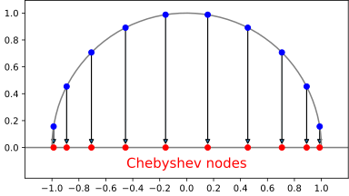

In a previous post I outlined the Fast Fourier Transform, which has many obvious uses regarding waves and periodic functions.
Personally, I have found more use in non-periodic function approximation, which we do largely with polynomials of various orthogonal bases.
In an incredible twist of fate, it turns out that the most ubiquitous polynomial basis, Chebyshev, is "Fourier in disguise" i.e. we can get one from the other under a special change of variables.
This means in some sense that in his study of the heat equation, Fourier solved not only all questions of periodic approximation, but that one hundred years later it would be realized that he had solved all non-periodic ones as well.
We can then put our DFT to good use solving any problem involving polynomial interpolation on an interval.

# Overview of Chebyshev
I won't belabor the details of approximation theory here. 
For references, I usually turn to Boyd's *Spectral Methods* book (a strange and wonderful gem), or Trefethen's *Approximation Theory and Approximation Practice*, but often the most useful is searching for relevant source code, as the theory is mainly relevant to justification and not implementation.
The one aspect I will discuss, is roughly how we translate from the periodic world of Fourier to the polynomial world of Chebyshev.

The first step of interpolation is choosing what points we wish to interpolate at.
For a periodic domain, we can show in various contexts that uniformly spaced points are optimal for various purposes.
Perhaps surprisingly, this is not true for an interval.
We will take the (non-periodic) interval \\( (-1, 1) \\) as the domain throughout.

# FFT
# Approximating a Function
# Differentiating a Function
# Solving an ODE
# Closing Remarks
ApproxFun.jl or Chebfun
